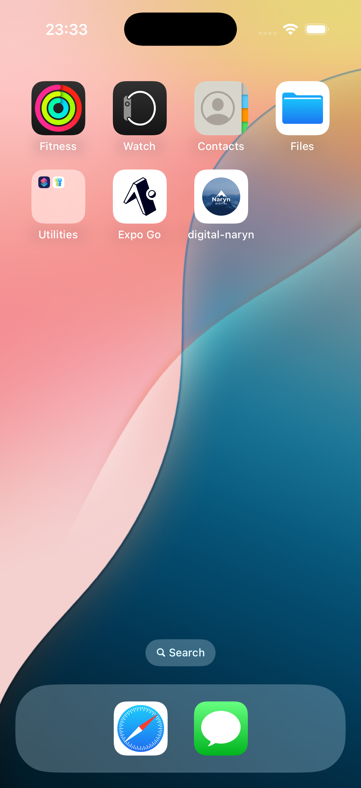
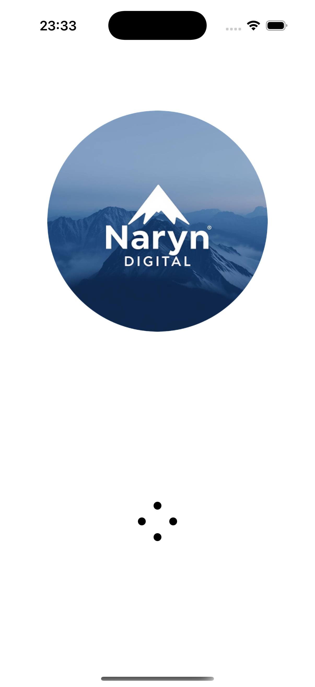
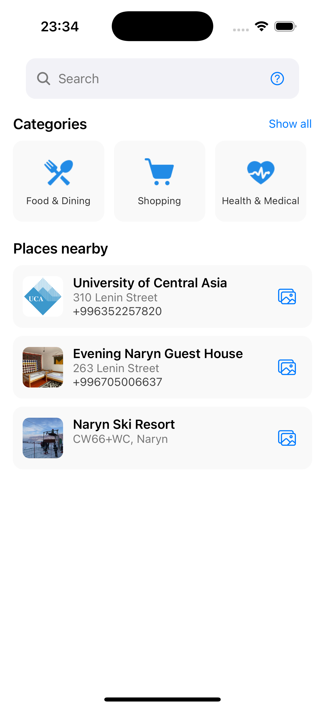
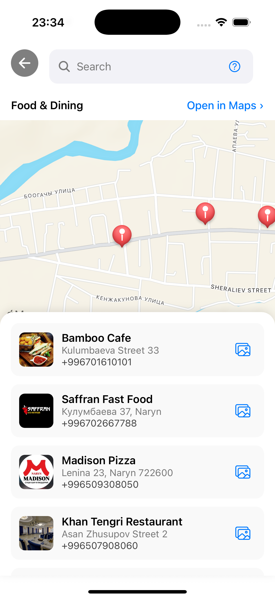
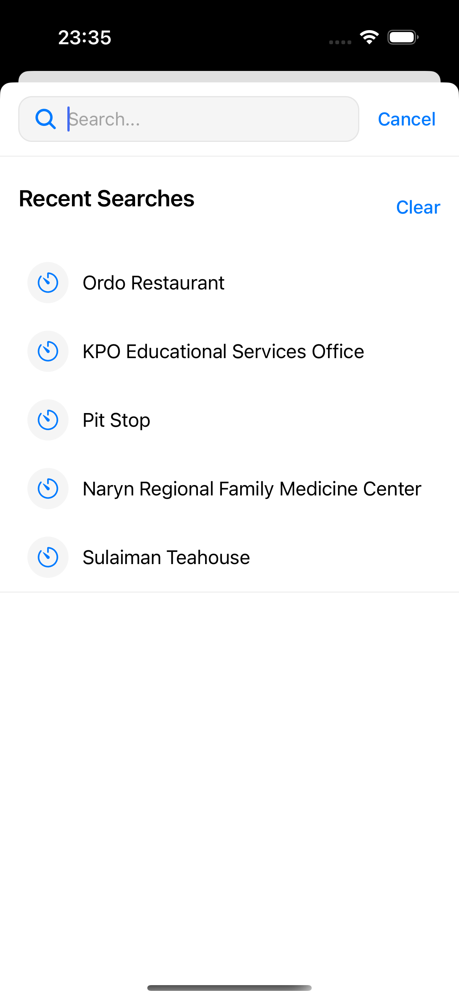
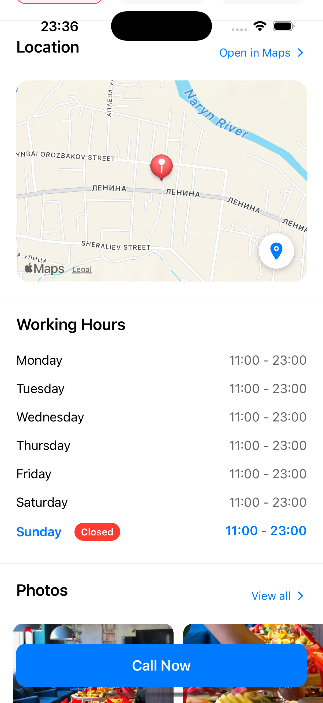
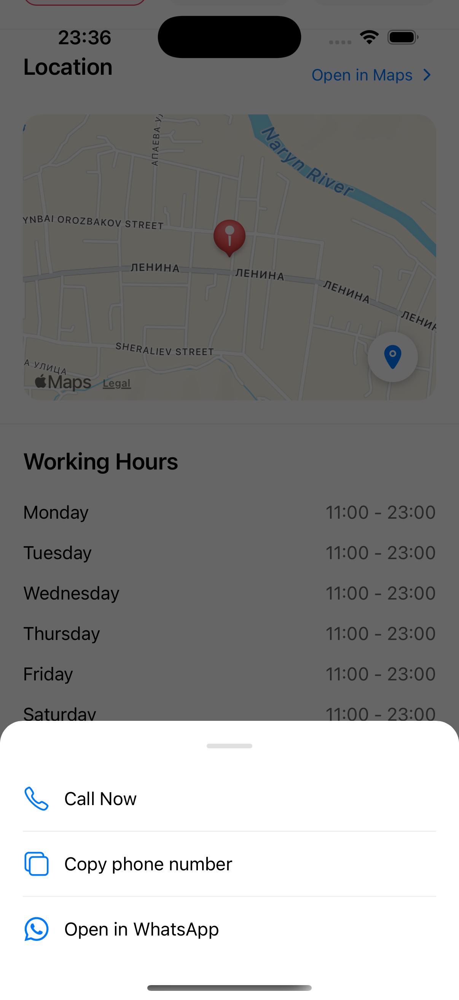
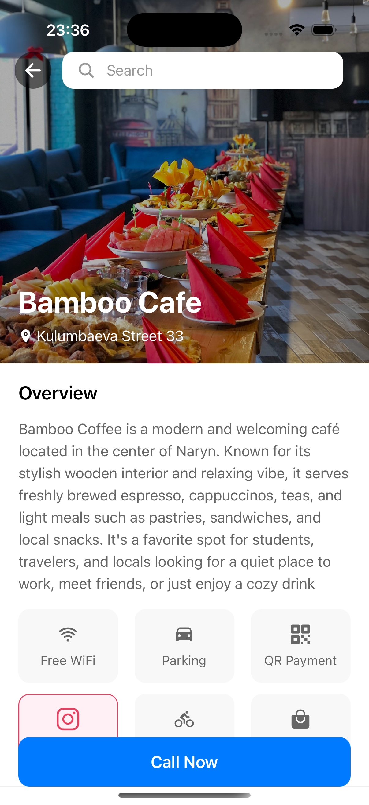
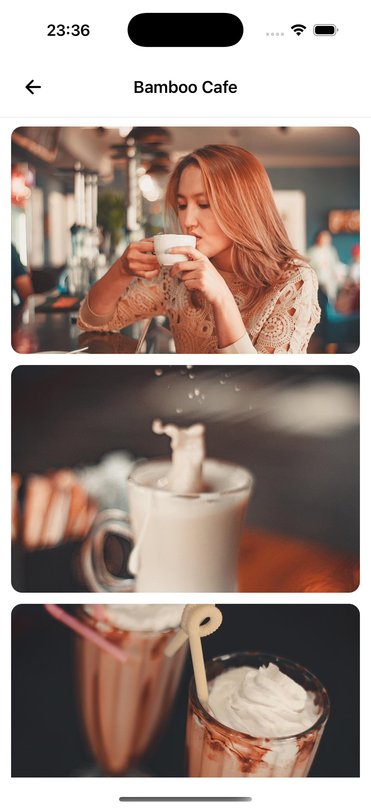

# Digital Naryn

A comprehensive mobile application for discovering and exploring local businesses and services in Naryn city. Built with React Native for the frontend and Django for the backend.

## 📱 Features

- Discover local businesses and services
- Real-time business information
- User-friendly interface
- Location-based services

## 🛠️ Tech Stack

### Frontend

- React Native
- Expo
- TypeScript

### Backend

- Django
- Django REST Framework
- PostgreSQL
- [Add other backend technologies]

## 🚀 Getting Started

### Prerequisites

- Node.js (v14 or higher)
- Python (v3.8 or higher)
- Expo CLI

### Installation

1. Clone the repository:

```bash
git clone [your-repository-url]
cd digital-naryn
```

2. Frontend Setup:

```bash
cd frontend
npm install
```

3. Backend Setup:

```bash
cd backend
python -m venv venv
source venv/bin/activate  # On Windows: venv\Scripts\activate
pip install -r requirements.txt
```

### ⚡️ Environment & API URL Setup (IMPORTANT!)

To make the app work on your emulator, simulator, or real device, you must set the correct API URL in your frontend `.env` file:

1. **Create a `.env` file in the `frontend/` directory:**

```
# For Android emulator
API_URL_ANDROID=http://10.0.2.2:8000

# For iOS simulator
API_URL_IOS=http://127.0.0.1:8000

# For real devices (replace with your computer's local IP address)
# API_URL_ANDROID=http://192.168.1.201:8000
# API_URL_IOS=http://192.168.1.201:8000
```

- To find your computer's local IP, run `ifconfig` (Mac/Linux) or `ipconfig` (Windows) and look for something like `192.168.x.x`.
- Make sure your phone and computer are on the same WiFi network.
- If you want to run on a real device, uncomment and set both URLs to your computer's IP.


3. **Start your backend with:**

   ```bash
   python manage.py runserver 0.0.0.0:8000
   ```

   - This makes your backend accessible to emulators, simulators, and real devices.

4. **Restart Expo with cache clear after changing `.env`:**
   ```bash
   npx expo start -c
   ```

### Local Development

#### Frontend Development

```bash
cd frontend
npx expo start
```

## 📸 Screenshots

<div align="center">
  <h3>App Screenshots</h3>
  
  <table>
    <tr>
      <td><br/>Home Screen</td>
      <td><br/>Business List</td>
      <td><br/>Business Details</td>
    </tr>
    <tr>
      <td><br/>Map View</td>
      <td><br/>Search</td>
      <td><br/>Categories</td>
    </tr>
    <tr>
      <td><br/>Profile</td>
      <td><br/>Settings</td>
      <td><br/>Notifications</td>
    </tr>
  </table>
</div>

## 🌐 Live Demo

### Backend Server

👉 [Access the live backend server](http://157.230.109.162:8000/)
